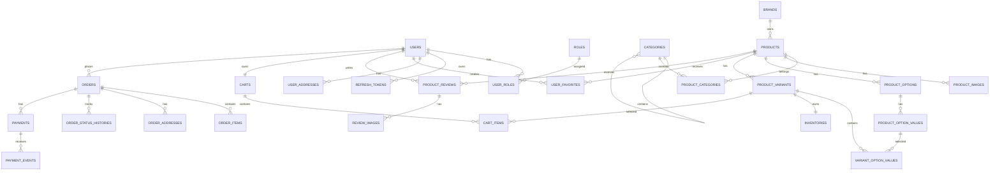

# Clothing Store — System Design

## 1. Giới thiệu

Clothing Store là website thương mại điện tử bán quần áo với kiến trúc frontend và backend tách biệt.

Hệ thống sử dụng:

```text
Frontend: Vue.js
Backend: Java Spring Boot
Database: MySQL
Build tool backend: Maven
Database migration: Flyway
```

Tài liệu này mô tả:

- Kiến trúc tổng thể.
- Phân quyền.
- Thiết kế database.
- Quan hệ giữa các bảng.
- Quy tắc nghiệp vụ.
- Thiết kế API.
- Thiết kế frontend.
- Bảo mật.
- Transaction.
- Tìm kiếm và phân trang.
- Thanh toán.
- Lộ trình phát triển.

---

# 2. Mục tiêu thiết kế

Thiết kế hệ thống cần đáp ứng:

- Dễ học.
- Dễ đọc.
- Dễ kiểm tra từng phần.
- Dễ bảo trì.
- Dễ mở rộng.
- Không phụ thuộc quá chặt giữa frontend và backend.
- Có thể bổ sung thêm vai trò trong tương lai.
- Có thể bổ sung nhiều phương thức thanh toán.
- Hỗ trợ sản phẩm có nhiều biến thể.
- Không làm mất lịch sử đơn hàng.
- Không làm mất lịch sử thanh toán.
- Có thể tối ưu hiệu năng khi số lượng sản phẩm tăng.
- Có thể phát triển thành dự án thực tế.

---

# 3. Phạm vi hệ thống

## 3.1. Khu vực CLIENT

CLIENT có thể:

- Đăng ký.
- Đăng nhập.
- Đăng xuất.
- Xem trang chủ.
- Xem banner.
- Xem chuyên mục.
- Xem thương hiệu.
- Xem danh sách sản phẩm.
- Tìm kiếm sản phẩm.
- Lọc sản phẩm.
- Xem chi tiết sản phẩm.
- Chọn màu và kích thước.
- Yêu thích sản phẩm.
- Đánh giá sản phẩm.
- Thêm vào giỏ hàng.
- Mua ngay.
- Thanh toán giỏ hàng.
- Quản lý địa chỉ.
- Quản lý hồ sơ.
- Xem lịch sử đơn hàng.

## 3.2. Khu vực ADMIN

ADMIN có thể:

- Xem dashboard.
- Quản lý chuyên mục.
- Quản lý thương hiệu.
- Quản lý banner.
- Quản lý sản phẩm.
- Quản lý biến thể.
- Quản lý tồn kho.
- Quản lý đánh giá.
- Quản lý người dùng.
- Quản lý đơn hàng.
- Quản lý thanh toán.

---

# 4. Kiến trúc hệ thống

```text
┌─────────────────────────────┐
│       Vue.js Frontend       │
│                             │
│  Client pages               │
│  Admin pages                │
│  Vue Router                 │
│  Pinia                      │
│  Axios                      │
└──────────────┬──────────────┘
               │
               │ HTTPS / REST / JSON
               ▼
┌─────────────────────────────┐
│    Spring Boot Backend      │
│                             │
│  Controller                 │
│  DTO                        │
│  Service                    │
│  Repository                 │
│  Security                   │
│  Validation                 │
└──────────────┬──────────────┘
               │
               │ JPA / SQL
               ▼
┌─────────────────────────────┐
│       MySQL Database        │
└─────────────────────────────┘
```

---

# 5. Kiến trúc backend

Backend sử dụng kiến trúc phân lớp.

```text
Controller
    ↓
Service
    ↓
Repository
    ↓
Database
```

## 5.1. Controller

Controller chịu trách nhiệm:

- Nhận HTTP request.
- Nhận path variable.
- Nhận query parameter.
- Nhận request body.
- Gọi Service.
- Trả response.

Controller không xử lý nghiệp vụ phức tạp.

## 5.2. DTO

DTO được sử dụng để:

- Nhận dữ liệu từ frontend.
- Trả dữ liệu cho frontend.
- Không để lộ Entity.
- Không trả trường nhạy cảm.
- Kiểm soát cấu trúc API.

Ví dụ:

```text
RegisterRequest
LoginRequest
UserResponse
ProductCreateRequest
ProductDetailResponse
```

## 5.3. Service

Service chịu trách nhiệm:

- Xử lý nghiệp vụ.
- Kiểm tra điều kiện.
- Kiểm tra quyền sở hữu.
- Gọi Repository.
- Quản lý transaction.
- Chuyển Entity thành DTO.

## 5.4. Repository

Repository chịu trách nhiệm:

- Truy vấn database.
- Tìm kiếm.
- Phân trang.
- Sắp xếp.
- Lưu dữ liệu.

## 5.5. Entity

Entity ánh xạ với bảng MySQL.

Entity không được trả trực tiếp cho frontend.

---

# 6. Kiến trúc module backend

```text
com.clothingstore
├── auth
├── user
├── category
├── brand
├── banner
├── product
├── favorite
├── review
├── cart
├── order
├── payment
├── dashboard
├── common
└── config
```

Mỗi module có thể gồm:

```text
controller
dto
entity
repository
service
mapper
```

---

# 7. Phân quyền

## 7.1. Vai trò ban đầu

```text
ADMIN
CLIENT
```

Trong tương lai có thể bổ sung:

```text
STAFF
PRODUCT_MANAGER
ORDER_MANAGER
SUPPORT
```

Vì vậy, không lưu một chuỗi `role` trực tiếp trong bảng `users`.

Hệ thống sử dụng:

```text
users
roles
user_roles
```

Một người dùng có thể có nhiều vai trò.

Một vai trò có thể được gán cho nhiều người dùng.

---

## 7.2. Quyền truy cập

| Chức năng | CLIENT | ADMIN |
|---|---:|---:|
| Đăng nhập | Có | Có |
| Xem sản phẩm | Có | Có |
| Yêu thích sản phẩm | Có | Không bắt buộc |
| Đánh giá sản phẩm | Có | Quản lý |
| Quản lý giỏ hàng | Có | Không |
| Tạo đơn hàng | Có | Không |
| Xem đơn hàng cá nhân | Có | Có |
| Quản lý chuyên mục | Không | Có |
| Quản lý banner | Không | Có |
| Quản lý thương hiệu | Không | Có |
| Quản lý sản phẩm | Không | Có |
| Quản lý người dùng | Không | Có |
| Quản lý thanh toán | Không | Có |
| Xem dashboard | Không | Có |

Backend là nơi quyết định cuối cùng người dùng có được truy cập hay không.

---

# 8. Thiết kế xác thực

## 8.1. Đăng ký

Luồng đăng ký:

```text
1. Frontend gửi thông tin đăng ký.
2. Backend kiểm tra email.
3. Backend kiểm tra số điện thoại.
4. Backend kiểm tra mật khẩu.
5. Backend mã hóa mật khẩu.
6. Backend tạo user.
7. Backend gán vai trò CLIENT.
8. Backend trả thông tin người dùng.
```

Người dùng không được gửi vai trò trong request đăng ký.

## 8.2. Đăng nhập

Luồng đăng nhập:

```text
1. Frontend gửi email và mật khẩu.
2. Backend tìm user theo email.
3. Backend kiểm tra trạng thái.
4. Backend so sánh mật khẩu.
5. Backend tạo access token.
6. Backend tạo refresh token.
7. Backend trả thông tin đăng nhập.
```

## 8.3. Mật khẩu

Database chỉ lưu:

```text
password_hash
```

Không lưu:

```text
password
plain_password
raw_password
```

Backend sử dụng BCrypt để băm mật khẩu.

## 8.4. Access token

Access token:

- Có thời gian sống ngắn.
- Được gửi trong header.
- Được dùng để gọi API cần đăng nhập.

Ví dụ:

```http
Authorization: Bearer access-token
```

## 8.5. Refresh token

Refresh token:

- Có thời gian sống dài hơn.
- Được sử dụng để tạo access token mới.
- Có thể bị thu hồi.
- Không nên lưu dạng nguyên bản trong database.
- Database chỉ lưu hash của refresh token.

Refresh token bị thu hồi khi:

- Người dùng đăng xuất.
- Người dùng đổi mật khẩu.
- Tài khoản bị khóa.
- Tài khoản bị xóa mềm.
- Phiên đăng nhập bị quản trị viên thu hồi.

---

# 9. Quy tắc thiết kế database

## 9.1. Tên bảng và cột

Sử dụng:

```text
snake_case
```

Ví dụ:

```text
product_variants
created_at
password_hash
```

## 9.2. Khóa chính

Sử dụng:

```sql
BIGINT UNSIGNED AUTO_INCREMENT
```

## 9.3. Tiền tệ

Sử dụng:

```sql
DECIMAL(15,2)
```

Không sử dụng:

```text
FLOAT
DOUBLE
```

## 9.4. Charset

Sử dụng:

```text
utf8mb4
```

## 9.5. Thời gian

Các bảng nghiệp vụ thường có:

```text
created_at
updated_at
```

Các bảng cần xóa mềm có thêm:

```text
deleted_at
```

## 9.6. Xóa mềm

Khi `deleted_at` khác `NULL`, bản ghi được xem là đã xóa.

Các bảng nên xóa mềm:

- users
- categories
- brands
- banners
- products
- product_variants
- product_reviews

## 9.7. Dữ liệu lịch sử

Không xóa vật lý:

- orders
- order_items
- order_addresses
- payments
- payment_events
- order_status_histories

---

# 10. Danh sách bảng

```text
Authentication
├── users
├── roles
├── user_roles
└── refresh_tokens

User data
└── user_addresses

Catalog
├── categories
├── brands
└── banners

Product
├── products
├── product_categories
├── product_images
├── product_options
├── product_option_values
├── product_variants
├── variant_option_values
└── inventories

Interaction
├── user_favorites
├── product_reviews
└── review_images

Cart
├── carts
└── cart_items

Order
├── orders
├── order_items
├── order_addresses
└── order_status_histories

Payment
├── payments
└── payment_events
```

---

# 11. Thiết kế bảng người dùng

## 11.1. Bảng `users`

| Cột | Kiểu dữ liệu | Ràng buộc | Mô tả |
|---|---|---|---|
| `id` | BIGINT UNSIGNED | PK, AUTO_INCREMENT | ID người dùng |
| `email` | VARCHAR(191) | NOT NULL, UNIQUE | Email đăng nhập |
| `password_hash` | VARCHAR(255) | NOT NULL | Mật khẩu đã băm |
| `full_name` | VARCHAR(100) | NOT NULL | Họ tên |
| `phone` | VARCHAR(20) | NULL, UNIQUE | Số điện thoại |
| `avatar_url` | VARCHAR(500) | NULL | Ảnh đại diện |
| `status` | VARCHAR(30) | NOT NULL | Trạng thái |
| `email_verified_at` | DATETIME | NULL | Ngày xác minh email |
| `last_login_at` | DATETIME | NULL | Lần đăng nhập cuối |
| `created_at` | DATETIME | NOT NULL | Ngày tạo |
| `updated_at` | DATETIME | NOT NULL | Ngày cập nhật |
| `deleted_at` | DATETIME | NULL | Ngày xóa mềm |

Trạng thái:

```text
PENDING
ACTIVE
LOCKED
INACTIVE
```

Index:

```sql
UNIQUE INDEX uk_users_email (email);
UNIQUE INDEX uk_users_phone (phone);
INDEX idx_users_status_created_at (status, created_at);
```

---

## 11.2. Bảng `roles`

| Cột | Kiểu dữ liệu | Ràng buộc |
|---|---|---|
| `id` | BIGINT UNSIGNED | PK, AUTO_INCREMENT |
| `code` | VARCHAR(50) | NOT NULL, UNIQUE |
| `name` | VARCHAR(100) | NOT NULL |
| `description` | VARCHAR(500) | NULL |
| `created_at` | DATETIME | NOT NULL |
| `updated_at` | DATETIME | NOT NULL |

Dữ liệu ban đầu:

```text
ADMIN
CLIENT
```

---

## 11.3. Bảng `user_roles`

| Cột | Kiểu dữ liệu | Ràng buộc |
|---|---|---|
| `user_id` | BIGINT UNSIGNED | PK, FK |
| `role_id` | BIGINT UNSIGNED | PK, FK |
| `assigned_at` | DATETIME | NOT NULL |
| `assigned_by` | BIGINT UNSIGNED | NULL, FK |

Khóa chính:

```text
user_id + role_id
```

Quan hệ:

```text
user_roles.user_id → users.id
user_roles.role_id → roles.id
user_roles.assigned_by → users.id
```

---

## 11.4. Bảng `refresh_tokens`

| Cột | Kiểu dữ liệu | Ràng buộc |
|---|---|---|
| `id` | BIGINT UNSIGNED | PK, AUTO_INCREMENT |
| `user_id` | BIGINT UNSIGNED | NOT NULL, FK |
| `token_hash` | VARCHAR(255) | NOT NULL, UNIQUE |
| `expires_at` | DATETIME | NOT NULL |
| `revoked_at` | DATETIME | NULL |
| `ip_address` | VARCHAR(45) | NULL |
| `user_agent` | VARCHAR(500) | NULL |
| `created_at` | DATETIME | NOT NULL |

Index:

```sql
UNIQUE INDEX uk_refresh_tokens_token_hash (token_hash);
INDEX idx_refresh_tokens_user_id (user_id);
INDEX idx_refresh_tokens_expires_at (expires_at);
```

---

# 12. Thiết kế địa chỉ

## 12.1. Bảng `user_addresses`

| Cột | Kiểu dữ liệu | Ràng buộc |
|---|---|---|
| `id` | BIGINT UNSIGNED | PK, AUTO_INCREMENT |
| `user_id` | BIGINT UNSIGNED | NOT NULL, FK |
| `receiver_name` | VARCHAR(100) | NOT NULL |
| `phone` | VARCHAR(20) | NOT NULL |
| `province` | VARCHAR(100) | NOT NULL |
| `district` | VARCHAR(100) | NOT NULL |
| `ward` | VARCHAR(100) | NOT NULL |
| `address_line` | VARCHAR(255) | NOT NULL |
| `postal_code` | VARCHAR(20) | NULL |
| `is_default` | BOOLEAN | NOT NULL |
| `created_at` | DATETIME | NOT NULL |
| `updated_at` | DATETIME | NOT NULL |
| `deleted_at` | DATETIME | NULL |

Quy tắc:

- Một người dùng có thể có nhiều địa chỉ.
- Mỗi người dùng chỉ nên có một địa chỉ mặc định.
- Người dùng chỉ được sửa địa chỉ của mình.

---

# 13. Thiết kế chuyên mục

## 13.1. Bảng `categories`

| Cột | Kiểu dữ liệu | Ràng buộc |
|---|---|---|
| `id` | BIGINT UNSIGNED | PK, AUTO_INCREMENT |
| `parent_id` | BIGINT UNSIGNED | NULL, FK |
| `name` | VARCHAR(150) | NOT NULL |
| `slug` | VARCHAR(191) | NOT NULL, UNIQUE |
| `description` | TEXT | NULL |
| `image_url` | VARCHAR(500) | NULL |
| `status` | VARCHAR(30) | NOT NULL |
| `sort_order` | INT | NOT NULL |
| `created_at` | DATETIME | NOT NULL |
| `updated_at` | DATETIME | NOT NULL |
| `deleted_at` | DATETIME | NULL |

Quan hệ:

```text
categories.parent_id → categories.id
```

Trạng thái:

```text
ACTIVE
INACTIVE
```

Index:

```sql
UNIQUE INDEX uk_categories_slug (slug);
INDEX idx_categories_parent_id (parent_id);
INDEX idx_categories_status_sort_order (status, sort_order);
```

---

# 14. Thiết kế thương hiệu

## 14.1. Bảng `brands`

| Cột | Kiểu dữ liệu | Ràng buộc |
|---|---|---|
| `id` | BIGINT UNSIGNED | PK, AUTO_INCREMENT |
| `name` | VARCHAR(150) | NOT NULL |
| `slug` | VARCHAR(191) | NOT NULL, UNIQUE |
| `logo_url` | VARCHAR(500) | NULL |
| `description` | TEXT | NULL |
| `status` | VARCHAR(30) | NOT NULL |
| `created_at` | DATETIME | NOT NULL |
| `updated_at` | DATETIME | NOT NULL |
| `deleted_at` | DATETIME | NULL |

Index:

```sql
UNIQUE INDEX uk_brands_slug (slug);
INDEX idx_brands_name (name);
INDEX idx_brands_status (status);
```

---

# 15. Thiết kế banner

## 15.1. Bảng `banners`

| Cột | Kiểu dữ liệu | Ràng buộc |
|---|---|---|
| `id` | BIGINT UNSIGNED | PK, AUTO_INCREMENT |
| `title` | VARCHAR(200) | NOT NULL |
| `description` | VARCHAR(500) | NULL |
| `image_url` | VARCHAR(500) | NOT NULL |
| `mobile_image_url` | VARCHAR(500) | NULL |
| `target_url` | VARCHAR(500) | NULL |
| `position` | VARCHAR(50) | NOT NULL |
| `status` | VARCHAR(30) | NOT NULL |
| `sort_order` | INT | NOT NULL |
| `start_at` | DATETIME | NULL |
| `end_at` | DATETIME | NULL |
| `created_at` | DATETIME | NOT NULL |
| `updated_at` | DATETIME | NOT NULL |
| `deleted_at` | DATETIME | NULL |

Vị trí:

```text
HOME_TOP
HOME_MIDDLE
CATEGORY_TOP
```

Index:

```sql
INDEX idx_banners_position_status (position, status);
INDEX idx_banners_display_time (start_at, end_at);
```

---

# 16. Thiết kế sản phẩm

## 16.1. Bảng `products`

| Cột | Kiểu dữ liệu | Ràng buộc |
|---|---|---|
| `id` | BIGINT UNSIGNED | PK, AUTO_INCREMENT |
| `brand_id` | BIGINT UNSIGNED | NULL, FK |
| `name` | VARCHAR(255) | NOT NULL |
| `slug` | VARCHAR(191) | NOT NULL, UNIQUE |
| `short_description` | VARCHAR(500) | NULL |
| `description` | LONGTEXT | NULL |
| `status` | VARCHAR(30) | NOT NULL |
| `is_featured` | BOOLEAN | NOT NULL |
| `favorite_count` | BIGINT UNSIGNED | NOT NULL, DEFAULT 0 |
| `review_count` | BIGINT UNSIGNED | NOT NULL, DEFAULT 0 |
| `average_rating` | DECIMAL(3,2) | NOT NULL, DEFAULT 0 |
| `created_by` | BIGINT UNSIGNED | NULL, FK |
| `updated_by` | BIGINT UNSIGNED | NULL, FK |
| `created_at` | DATETIME | NOT NULL |
| `updated_at` | DATETIME | NOT NULL |
| `deleted_at` | DATETIME | NULL |

Trạng thái:

```text
DRAFT
ACTIVE
INACTIVE
```

Các trường:

```text
favorite_count
review_count
average_rating
```

là dữ liệu tổng hợp để tăng tốc độ hiển thị.

Dữ liệu gốc vẫn nằm tại:

```text
user_favorites
product_reviews
```

Index:

```sql
UNIQUE INDEX uk_products_slug (slug);
INDEX idx_products_brand_status (brand_id, status);
INDEX idx_products_featured_status (is_featured, status);
INDEX idx_products_created_at (created_at);
INDEX idx_products_favorite_count (favorite_count);
INDEX idx_products_average_rating (average_rating);
```

---

## 16.2. Bảng `product_categories`

Một sản phẩm có thể thuộc nhiều chuyên mục.

| Cột | Kiểu dữ liệu | Ràng buộc |
|---|---|---|
| `product_id` | BIGINT UNSIGNED | PK, FK |
| `category_id` | BIGINT UNSIGNED | PK, FK |
| `is_primary` | BOOLEAN | NOT NULL |
| `created_at` | DATETIME | NOT NULL |

Khóa chính:

```text
product_id + category_id
```

Quy tắc:

- Một sản phẩm có thể có nhiều chuyên mục.
- Một sản phẩm chỉ nên có một chuyên mục chính.

---

## 16.3. Bảng `product_images`

| Cột | Kiểu dữ liệu | Ràng buộc |
|---|---|---|
| `id` | BIGINT UNSIGNED | PK, AUTO_INCREMENT |
| `product_id` | BIGINT UNSIGNED | NOT NULL, FK |
| `variant_id` | BIGINT UNSIGNED | NULL, FK |
| `image_url` | VARCHAR(500) | NOT NULL |
| `alt_text` | VARCHAR(255) | NULL |
| `is_thumbnail` | BOOLEAN | NOT NULL |
| `sort_order` | INT | NOT NULL |
| `created_at` | DATETIME | NOT NULL |

`variant_id` cho phép một hình ảnh thuộc biến thể cụ thể.

Ví dụ:

```text
Ảnh áo màu đen → biến thể màu đen
Ảnh áo màu trắng → biến thể màu trắng
```

---

## 16.4. Bảng `product_options`

Lưu loại tùy chọn.

Ví dụ:

```text
Color
Size
Material
```

| Cột | Kiểu dữ liệu | Ràng buộc |
|---|---|---|
| `id` | BIGINT UNSIGNED | PK, AUTO_INCREMENT |
| `product_id` | BIGINT UNSIGNED | NOT NULL, FK |
| `name` | VARCHAR(100) | NOT NULL |
| `sort_order` | INT | NOT NULL |
| `created_at` | DATETIME | NOT NULL |

---

## 16.5. Bảng `product_option_values`

Ví dụ:

```text
Color: Đen, Trắng, Xanh
Size: S, M, L, XL
```

| Cột | Kiểu dữ liệu | Ràng buộc |
|---|---|---|
| `id` | BIGINT UNSIGNED | PK, AUTO_INCREMENT |
| `option_id` | BIGINT UNSIGNED | NOT NULL, FK |
| `value` | VARCHAR(100) | NOT NULL |
| `display_value` | VARCHAR(100) | NULL |
| `color_code` | VARCHAR(20) | NULL |
| `sort_order` | INT | NOT NULL |
| `created_at` | DATETIME | NOT NULL |

---

## 16.6. Bảng `product_variants`

| Cột | Kiểu dữ liệu | Ràng buộc |
|---|---|---|
| `id` | BIGINT UNSIGNED | PK, AUTO_INCREMENT |
| `product_id` | BIGINT UNSIGNED | NOT NULL, FK |
| `sku` | VARCHAR(100) | NOT NULL, UNIQUE |
| `price` | DECIMAL(15,2) | NOT NULL |
| `compare_at_price` | DECIMAL(15,2) | NULL |
| `cost_price` | DECIMAL(15,2) | NULL |
| `weight_grams` | INT | NULL |
| `status` | VARCHAR(30) | NOT NULL |
| `created_at` | DATETIME | NOT NULL |
| `updated_at` | DATETIME | NOT NULL |
| `deleted_at` | DATETIME | NULL |

Ví dụ:

```text
SKU: TSHIRT-BLACK-M
Price: 250000
Color: Black
Size: M
```

Index:

```sql
UNIQUE INDEX uk_product_variants_sku (sku);
INDEX idx_product_variants_product_status (product_id, status);
INDEX idx_product_variants_price (price);
```

---

## 16.7. Bảng `variant_option_values`

| Cột | Kiểu dữ liệu | Ràng buộc |
|---|---|---|
| `variant_id` | BIGINT UNSIGNED | PK, FK |
| `option_value_id` | BIGINT UNSIGNED | PK, FK |

Ví dụ:

```text
Variant TSHIRT-BLACK-M
├── Color: Black
└── Size: M
```

---

## 16.8. Bảng `inventories`

| Cột | Kiểu dữ liệu | Ràng buộc |
|---|---|---|
| `variant_id` | BIGINT UNSIGNED | PK, FK |
| `quantity_available` | INT | NOT NULL |
| `quantity_reserved` | INT | NOT NULL |
| `reorder_level` | INT | NOT NULL |
| `updated_at` | DATETIME | NOT NULL |

Công thức:

```text
Số lượng có thể bán =
quantity_available - quantity_reserved
```

Quy tắc:

```text
quantity_available >= 0
quantity_reserved >= 0
quantity_reserved <= quantity_available
```

---

# 17. Thiết kế yêu thích

## 17.1. Bảng `user_favorites`

| Cột | Kiểu dữ liệu | Ràng buộc |
|---|---|---|
| `id` | BIGINT UNSIGNED | PK, AUTO_INCREMENT |
| `user_id` | BIGINT UNSIGNED | NOT NULL, FK |
| `product_id` | BIGINT UNSIGNED | NOT NULL, FK |
| `created_at` | DATETIME | NOT NULL |

Ràng buộc:

```sql
UNIQUE INDEX uk_user_favorites_user_product
(user_id, product_id);
```

Index:

```sql
INDEX idx_user_favorites_product_id (product_id);
INDEX idx_user_favorites_user_created_at
(user_id, created_at);
```

Quy tắc:

- Một user chỉ yêu thích một product một lần.
- Khi thêm yêu thích, tăng `favorite_count`.
- Khi bỏ yêu thích, giảm `favorite_count`.
- `favorite_count` không được âm.

---

# 18. Thiết kế đánh giá

## 18.1. Bảng `product_reviews`

| Cột | Kiểu dữ liệu | Ràng buộc |
|---|---|---|
| `id` | BIGINT UNSIGNED | PK, AUTO_INCREMENT |
| `product_id` | BIGINT UNSIGNED | NOT NULL, FK |
| `user_id` | BIGINT UNSIGNED | NOT NULL, FK |
| `order_item_id` | BIGINT UNSIGNED | NOT NULL, FK |
| `rating` | TINYINT UNSIGNED | NOT NULL |
| `content` | TEXT | NULL |
| `status` | VARCHAR(30) | NOT NULL |
| `is_verified_purchase` | BOOLEAN | NOT NULL |
| `created_at` | DATETIME | NOT NULL |
| `updated_at` | DATETIME | NOT NULL |
| `deleted_at` | DATETIME | NULL |

Rating:

```text
1
2
3
4
5
```

Trạng thái:

```text
PENDING
VISIBLE
HIDDEN
REJECTED
```

Ràng buộc:

```sql
CHECK (rating BETWEEN 1 AND 5);
```

Một người dùng chỉ có một đánh giá cho mỗi sản phẩm:

```sql
UNIQUE INDEX uk_product_reviews_user_product
(user_id, product_id);
```

Index:

```sql
INDEX idx_product_reviews_product_status
(product_id, status);

INDEX idx_product_reviews_product_rating
(product_id, rating);

INDEX idx_product_reviews_user_id
(user_id);
```

---

## 18.2. Bảng `review_images`

| Cột | Kiểu dữ liệu | Ràng buộc |
|---|---|---|
| `id` | BIGINT UNSIGNED | PK, AUTO_INCREMENT |
| `review_id` | BIGINT UNSIGNED | NOT NULL, FK |
| `image_url` | VARCHAR(500) | NOT NULL |
| `sort_order` | INT | NOT NULL |
| `created_at` | DATETIME | NOT NULL |

Bảng này có thể được triển khai sau.

---

# 19. Thiết kế giỏ hàng

## 19.1. Bảng `carts`

| Cột | Kiểu dữ liệu | Ràng buộc |
|---|---|---|
| `id` | BIGINT UNSIGNED | PK, AUTO_INCREMENT |
| `user_id` | BIGINT UNSIGNED | NOT NULL, UNIQUE, FK |
| `created_at` | DATETIME | NOT NULL |
| `updated_at` | DATETIME | NOT NULL |

Mỗi user có một giỏ hàng đang hoạt động.

---

## 19.2. Bảng `cart_items`

| Cột | Kiểu dữ liệu | Ràng buộc |
|---|---|---|
| `id` | BIGINT UNSIGNED | PK, AUTO_INCREMENT |
| `cart_id` | BIGINT UNSIGNED | NOT NULL, FK |
| `variant_id` | BIGINT UNSIGNED | NOT NULL, FK |
| `quantity` | INT | NOT NULL |
| `created_at` | DATETIME | NOT NULL |
| `updated_at` | DATETIME | NOT NULL |

Ràng buộc:

```sql
UNIQUE INDEX uk_cart_items_cart_variant
(cart_id, variant_id);
```

Quy tắc:

- Quantity phải lớn hơn 0.
- Không thêm biến thể đã ngừng hoạt động.
- Không thêm quá số lượng có thể bán.
- Giá không lưu cố định trong giỏ hàng.
- Giá phải được kiểm tra lại khi checkout.

---

# 20. Thiết kế đơn hàng

## 20.1. Bảng `orders`

| Cột | Kiểu dữ liệu | Ràng buộc |
|---|---|---|
| `id` | BIGINT UNSIGNED | PK, AUTO_INCREMENT |
| `order_code` | VARCHAR(50) | NOT NULL, UNIQUE |
| `user_id` | BIGINT UNSIGNED | NOT NULL, FK |
| `checkout_type` | VARCHAR(30) | NOT NULL |
| `status` | VARCHAR(30) | NOT NULL |
| `payment_status` | VARCHAR(30) | NOT NULL |
| `subtotal` | DECIMAL(15,2) | NOT NULL |
| `discount_amount` | DECIMAL(15,2) | NOT NULL |
| `shipping_fee` | DECIMAL(15,2) | NOT NULL |
| `total_amount` | DECIMAL(15,2) | NOT NULL |
| `currency` | VARCHAR(10) | NOT NULL |
| `customer_note` | VARCHAR(1000) | NULL |
| `admin_note` | VARCHAR(1000) | NULL |
| `placed_at` | DATETIME | NULL |
| `cancelled_at` | DATETIME | NULL |
| `archived_at` | DATETIME | NULL |
| `created_at` | DATETIME | NOT NULL |
| `updated_at` | DATETIME | NOT NULL |

Checkout type:

```text
BUY_NOW
CART
```

Order status:

```text
PENDING
CONFIRMED
PROCESSING
SHIPPING
COMPLETED
CANCELLED
```

Payment status:

```text
UNPAID
PENDING
PAID
FAILED
REFUNDED
PARTIALLY_REFUNDED
```

Index:

```sql
UNIQUE INDEX uk_orders_order_code (order_code);
INDEX idx_orders_user_created_at (user_id, created_at);
INDEX idx_orders_status_created_at (status, created_at);
INDEX idx_orders_payment_status (payment_status);
```

---

## 20.2. Bảng `order_items`

Bảng này lưu snapshot sản phẩm tại thời điểm đặt hàng.

| Cột | Kiểu dữ liệu | Ràng buộc |
|---|---|---|
| `id` | BIGINT UNSIGNED | PK, AUTO_INCREMENT |
| `order_id` | BIGINT UNSIGNED | NOT NULL, FK |
| `product_id` | BIGINT UNSIGNED | NULL, FK |
| `variant_id` | BIGINT UNSIGNED | NULL, FK |
| `product_name` | VARCHAR(255) | NOT NULL |
| `sku` | VARCHAR(100) | NOT NULL |
| `option_summary` | VARCHAR(500) | NULL |
| `unit_price` | DECIMAL(15,2) | NOT NULL |
| `quantity` | INT | NOT NULL |
| `total_price` | DECIMAL(15,2) | NOT NULL |
| `created_at` | DATETIME | NOT NULL |

Ví dụ:

```text
Product: Áo thun Basic
SKU: TSHIRT-BLACK-M
Option: Màu Đen, Size M
Unit price: 250000
Quantity: 2
Total: 500000
```

Dữ liệu snapshot giúp đơn hàng cũ không bị thay đổi khi ADMIN sửa sản phẩm.

---

## 20.3. Bảng `order_addresses`

| Cột | Kiểu dữ liệu | Ràng buộc |
|---|---|---|
| `id` | BIGINT UNSIGNED | PK, AUTO_INCREMENT |
| `order_id` | BIGINT UNSIGNED | NOT NULL, FK |
| `type` | VARCHAR(20) | NOT NULL |
| `receiver_name` | VARCHAR(100) | NOT NULL |
| `phone` | VARCHAR(20) | NOT NULL |
| `province` | VARCHAR(100) | NOT NULL |
| `district` | VARCHAR(100) | NOT NULL |
| `ward` | VARCHAR(100) | NOT NULL |
| `address_line` | VARCHAR(255) | NOT NULL |
| `postal_code` | VARCHAR(20) | NULL |

Type:

```text
SHIPPING
BILLING
```

Địa chỉ đơn hàng phải được lưu riêng.

Nếu người dùng sửa địa chỉ profile, địa chỉ của đơn hàng cũ không được thay đổi.

---

## 20.4. Bảng `order_status_histories`

| Cột | Kiểu dữ liệu | Ràng buộc |
|---|---|---|
| `id` | BIGINT UNSIGNED | PK, AUTO_INCREMENT |
| `order_id` | BIGINT UNSIGNED | NOT NULL, FK |
| `old_status` | VARCHAR(30) | NULL |
| `new_status` | VARCHAR(30) | NOT NULL |
| `note` | VARCHAR(500) | NULL |
| `changed_by` | BIGINT UNSIGNED | NULL, FK |
| `created_at` | DATETIME | NOT NULL |

Mỗi lần thay đổi trạng thái đơn hàng phải tạo lịch sử.

---

# 21. Thiết kế thanh toán

## 21.1. Bảng `payments`

Một đơn hàng có thể có nhiều lần thử thanh toán.

| Cột | Kiểu dữ liệu | Ràng buộc |
|---|---|---|
| `id` | BIGINT UNSIGNED | PK, AUTO_INCREMENT |
| `order_id` | BIGINT UNSIGNED | NOT NULL, FK |
| `provider` | VARCHAR(50) | NOT NULL |
| `method` | VARCHAR(50) | NOT NULL |
| `status` | VARCHAR(30) | NOT NULL |
| `amount` | DECIMAL(15,2) | NOT NULL |
| `currency` | VARCHAR(10) | NOT NULL |
| `provider_transaction_id` | VARCHAR(191) | NULL |
| `failure_reason` | VARCHAR(500) | NULL |
| `paid_at` | DATETIME | NULL |
| `failed_at` | DATETIME | NULL |
| `created_at` | DATETIME | NOT NULL |
| `updated_at` | DATETIME | NOT NULL |

Provider:

```text
COD
VNPAY
MOMO
STRIPE
PAYPAL
```

Method:

```text
CASH_ON_DELIVERY
BANK_TRANSFER
E_WALLET
CREDIT_CARD
```

Index:

```sql
INDEX idx_payments_order_id (order_id);
INDEX idx_payments_status_created_at (status, created_at);

UNIQUE INDEX uk_payments_provider_transaction
(provider, provider_transaction_id);
```

---

## 21.2. Bảng `payment_events`

| Cột | Kiểu dữ liệu | Ràng buộc |
|---|---|---|
| `id` | BIGINT UNSIGNED | PK, AUTO_INCREMENT |
| `payment_id` | BIGINT UNSIGNED | NULL, FK |
| `provider` | VARCHAR(50) | NOT NULL |
| `provider_event_id` | VARCHAR(191) | NULL |
| `event_type` | VARCHAR(100) | NOT NULL |
| `payload` | JSON | NULL |
| `processed` | BOOLEAN | NOT NULL |
| `processed_at` | DATETIME | NULL |
| `created_at` | DATETIME | NOT NULL |

Mục đích:

- Lưu webhook.
- Tránh xử lý sự kiện nhiều lần.
- Điều tra lỗi.
- Đối chiếu giao dịch.
- Kiểm tra dữ liệu từ cổng thanh toán.

---

# 22. Sơ đồ quan hệ database



---

# 23. Quy tắc nghiệp vụ

## 23.1. Đăng ký

- Email không được trùng.
- Mật khẩu phải được mã hóa.
- Người đăng ký nhận vai trò CLIENT.
- Không cho phép gửi role từ frontend.
- Không tạo user nếu gán role thất bại.
- Tạo user và gán role trong cùng transaction.

## 23.2. Đăng nhập

- User phải tồn tại.
- User không bị khóa.
- User không bị xóa mềm.
- Password phải đúng.
- Cập nhật `last_login_at`.
- Tạo refresh token mới.
- Có thể giới hạn số phiên đăng nhập sau này.

## 23.3. Chuyên mục

- Slug không được trùng.
- Không cho danh mục làm cha của chính nó.
- Không tạo vòng lặp cha con.
- Danh mục đã xóa không hiển thị cho CLIENT.

## 23.4. Sản phẩm

- Sản phẩm phải có ít nhất một chuyên mục.
- Sản phẩm phải có ít nhất một biến thể trước khi bán.
- SKU không được trùng.
- Giá không được âm.
- Giá khuyến mãi không nên lớn hơn giá gốc.
- Tồn kho không được âm.
- Sản phẩm `DRAFT` không hiển thị phía CLIENT.
- Sản phẩm xóa mềm không được mua.

## 23.5. Yêu thích

- User phải đăng nhập.
- Product phải tồn tại.
- Product phải đang hoạt động.
- Không thêm trùng.
- Thêm hoặc xóa favorite phải cập nhật `favorite_count`.

## 23.6. Đánh giá

- User phải đăng nhập.
- User đã mua product.
- Order phải ở trạng thái `COMPLETED`.
- Rating từ 1 đến 5.
- Một user chỉ đánh giá một product một lần.
- Khi đánh giá thay đổi, phải cập nhật average rating.
- ADMIN chỉ được ẩn, không sửa nội dung.

## 23.7. Giỏ hàng

- Chỉ thêm variant đang hoạt động.
- Quantity lớn hơn 0.
- Không thêm quá tồn kho có thể bán.
- Một variant chỉ xuất hiện một lần trong cart.
- Khi thêm lại cùng variant, tăng quantity.

## 23.8. Checkout

Backend phải:

```text
1. Xác định loại checkout.
2. Lấy danh sách item.
3. Kiểm tra product.
4. Kiểm tra variant.
5. Kiểm tra trạng thái.
6. Kiểm tra tồn kho.
7. Lấy giá hiện tại.
8. Tính lại subtotal.
9. Tính phí vận chuyển.
10. Tính giảm giá nếu có.
11. Tính total.
12. Tạo order.
13. Tạo order item.
14. Lưu địa chỉ snapshot.
15. Giữ tồn kho.
16. Tạo payment.
```

Frontend không được quyết định tổng tiền cuối cùng.

## 23.9. Hủy đơn hàng

Khi hủy:

- Kiểm tra trạng thái hiện tại.
- Không hủy đơn đã hoàn thành.
- Hoàn lại tồn kho đã giữ.
- Cập nhật trạng thái.
- Tạo lịch sử.
- Xử lý hoàn tiền nếu đã thanh toán.

## 23.10. Thanh toán

- Không tin tưởng kết quả thanh toán từ frontend.
- Phải xác minh với nhà cung cấp.
- Số tiền phải khớp.
- Mã giao dịch không được xử lý trùng.
- Webhook phải có tính idempotent.
- Chỉ cập nhật `PAID` sau khi xác minh thành công.

---

# 24. Transaction

Các chức năng cần transaction:

- Đăng ký và gán vai trò.
- Thêm favorite và cập nhật favorite count.
- Tạo hoặc sửa review và cập nhật rating.
- Tạo đơn hàng.
- Giữ tồn kho.
- Hủy đơn và hoàn tồn kho.
- Xác nhận thanh toán.
- Hoàn tiền.
- Cập nhật trạng thái và tạo lịch sử.

Ví dụ tạo đơn hàng:

```text
BEGIN TRANSACTION

Create orders
Create order_items
Create order_addresses
Update inventories
Create order_status_histories
Create payments

COMMIT
```

Nếu một bước thất bại:

```text
ROLLBACK
```

---

# 25. API xác thực

## Đăng ký

```http
POST /api/v1/auth/register
```

Request:

```json
{
  "email": "client@example.com",
  "password": "Password123",
  "confirmPassword": "Password123",
  "fullName": "Nguyen Van A",
  "phone": "0900000000"
}
```

## Đăng nhập

```http
POST /api/v1/auth/login
```

Request:

```json
{
  "email": "client@example.com",
  "password": "Password123"
}
```

## Người dùng hiện tại

```http
GET /api/v1/auth/me
```

## Làm mới token

```http
POST /api/v1/auth/refresh
```

## Đăng xuất

```http
POST /api/v1/auth/logout
```

---

# 26. API ADMIN

## Chuyên mục

```text
GET    /api/v1/admin/categories
GET    /api/v1/admin/categories/{id}
POST   /api/v1/admin/categories
PUT    /api/v1/admin/categories/{id}
DELETE /api/v1/admin/categories/{id}
```

## Thương hiệu

```text
GET    /api/v1/admin/brands
GET    /api/v1/admin/brands/{id}
POST   /api/v1/admin/brands
PUT    /api/v1/admin/brands/{id}
DELETE /api/v1/admin/brands/{id}
```

## Banner

```text
GET    /api/v1/admin/banners
GET    /api/v1/admin/banners/{id}
POST   /api/v1/admin/banners
PUT    /api/v1/admin/banners/{id}
DELETE /api/v1/admin/banners/{id}
```

## Sản phẩm

```text
GET    /api/v1/admin/products
GET    /api/v1/admin/products/{id}
POST   /api/v1/admin/products
PUT    /api/v1/admin/products/{id}
DELETE /api/v1/admin/products/{id}
```

## Người dùng

```text
GET   /api/v1/admin/users
GET   /api/v1/admin/users/{id}
PUT   /api/v1/admin/users/{id}
PATCH /api/v1/admin/users/{id}/lock
PATCH /api/v1/admin/users/{id}/unlock
DELETE /api/v1/admin/users/{id}
```

## Đơn hàng

```text
GET   /api/v1/admin/orders
GET   /api/v1/admin/orders/{orderCode}
PATCH /api/v1/admin/orders/{orderCode}/status
PATCH /api/v1/admin/orders/{orderCode}/cancel
```

## Đánh giá

```text
GET   /api/v1/admin/reviews
PATCH /api/v1/admin/reviews/{id}/hide
PATCH /api/v1/admin/reviews/{id}/show
```

## Thanh toán

```text
GET /api/v1/admin/payments
GET /api/v1/admin/payments/{id}
```

## Dashboard

```text
GET /api/v1/admin/dashboard/summary
GET /api/v1/admin/dashboard/revenue
GET /api/v1/admin/dashboard/top-products
GET /api/v1/admin/dashboard/recent-orders
GET /api/v1/admin/dashboard/low-stock
```

---

# 27. API CLIENT

## Trang chủ

```text
GET /api/v1/home
GET /api/v1/banners
GET /api/v1/categories
GET /api/v1/brands
```

## Sản phẩm

```text
GET /api/v1/products
GET /api/v1/products/{slug}
GET /api/v1/products/{productId}/reviews
```

## Yêu thích

```text
GET    /api/v1/account/favorites
POST   /api/v1/account/favorites/{productId}
DELETE /api/v1/account/favorites/{productId}
GET    /api/v1/account/favorites/{productId}/status
```

Backend lấy user ID từ token.

Frontend không được gửi user ID để chọn tài khoản.

## Đánh giá

```text
POST   /api/v1/products/{productId}/reviews
PUT    /api/v1/account/reviews/{reviewId}
DELETE /api/v1/account/reviews/{reviewId}
GET    /api/v1/account/reviews
```

## Giỏ hàng

```text
GET    /api/v1/cart
POST   /api/v1/cart/items
PUT    /api/v1/cart/items/{itemId}
DELETE /api/v1/cart/items/{itemId}
```

## Checkout

```text
POST /api/v1/checkout
```

## Đơn hàng

```text
GET   /api/v1/account/orders
GET   /api/v1/account/orders/{orderCode}
PATCH /api/v1/account/orders/{orderCode}/cancel
```

## Profile

```text
GET /api/v1/account/profile
PUT /api/v1/account/profile
PUT /api/v1/account/password
```

## Địa chỉ

```text
GET    /api/v1/account/addresses
POST   /api/v1/account/addresses
PUT    /api/v1/account/addresses/{id}
DELETE /api/v1/account/addresses/{id}
```

---

# 28. Tìm kiếm và lọc sản phẩm

API:

```http
GET /api/v1/products
```

Query parameter:

```text
keyword
categoryId
brandId
sizeValue
colorValue
minPrice
maxPrice
inStock
minimumRating
sort
page
pageSize
```

Ví dụ:

```http
GET /api/v1/products?keyword=ao&categoryId=5&page=0&pageSize=20
```

```http
GET /api/v1/products?sizeValue=M&colorValue=Black
```

```http
GET /api/v1/products?brandId=2&minPrice=200000&maxPrice=500000
```

Sort:

```text
newest
price_asc
price_desc
favorite_desc
rating_desc
```

---

# 29. Phân trang

Không trả toàn bộ sản phẩm cùng lúc.

Response:

```json
{
  "success": true,
  "message": "Lấy danh sách sản phẩm thành công",
  "data": {
    "content": [],
    "page": 0,
    "size": 20,
    "totalElements": 125,
    "totalPages": 7,
    "first": true,
    "last": false
  }
}
```

---

# 30. Hai luồng checkout

## 30.1. Mua ngay

Request:

```json
{
  "checkoutType": "BUY_NOW",
  "items": [
    {
      "variantId": 101,
      "quantity": 1
    }
  ],
  "addressId": 12,
  "paymentMethod": "CASH_ON_DELIVERY",
  "customerNote": ""
}
```

## 30.2. Thanh toán giỏ hàng

Request:

```json
{
  "checkoutType": "CART",
  "cartItemIds": [
    20,
    21,
    25
  ],
  "addressId": 12,
  "paymentMethod": "CASH_ON_DELIVERY",
  "customerNote": ""
}
```

Cả hai luồng sử dụng chung:

```text
CheckoutService
```

Không viết hai bộ logic riêng biệt.

---

# 31. Thiết kế frontend

## 31.1. Layout

```text
AuthLayout
├── Login
└── Register

ClientLayout
├── Home
├── Product list
├── Product detail
├── Favorites
├── Cart
├── Checkout
├── Profile
└── Orders

AdminLayout
├── Dashboard
├── Categories
├── Brands
├── Banners
├── Products
├── Users
├── Reviews
├── Orders
└── Payments
```

## 31.2. Router meta

Route yêu cầu đăng nhập:

```javascript
meta: {
  requiresAuth: true
}
```

Route yêu cầu ADMIN:

```javascript
meta: {
  requiresAuth: true,
  requiredRole: "ADMIN"
}
```

## 31.3. Pinia store

Dự kiến:

```text
authStore
cartStore
favoriteStore
productFilterStore
```

## 31.4. Axios interceptor

Axios interceptor có thể:

- Gắn access token.
- Xử lý lỗi 401.
- Gọi refresh token.
- Gửi lại request cũ.
- Đăng xuất nếu refresh thất bại.

---

# 32. Bảo mật

- Mã hóa mật khẩu bằng BCrypt.
- Không trả password hash.
- Không tin user ID từ frontend.
- Lấy user hiện tại từ token.
- Kiểm tra quyền ở backend.
- Kiểm tra quyền sở hữu dữ liệu.
- Validate mọi request.
- Không tin giá frontend gửi lên.
- Không tin trạng thái thanh toán frontend gửi lên.
- Giới hạn loại file upload.
- Giới hạn kích thước file.
- Không lưu secret trong source code.
- Sử dụng biến môi trường.
- Sử dụng HTTPS khi triển khai.
- Cấu hình CORS chỉ cho domain frontend hợp lệ.
- Không ghi access token, password hoặc thông tin thẻ vào log.

---

# 33. Xử lý lỗi

Các lỗi chính:

```text
400 Bad Request
401 Unauthorized
403 Forbidden
404 Not Found
409 Conflict
422 Unprocessable Entity
500 Internal Server Error
```

Ví dụ:

```json
{
  "success": false,
  "message": "Sản phẩm không tồn tại",
  "data": null
}
```

Validation:

```json
{
  "success": false,
  "message": "Dữ liệu không hợp lệ",
  "errors": {
    "price": "Giá sản phẩm không được âm"
  }
}
```

Backend nên sử dụng global exception handler.

---

# 34. Upload hình ảnh

Các loại ảnh:

- Avatar.
- Banner.
- Logo thương hiệu.
- Ảnh sản phẩm.
- Ảnh đánh giá.

Database chỉ lưu URL hoặc đường dẫn.

Không lưu file ảnh trực tiếp dưới dạng dữ liệu lớn trong bảng nghiệp vụ.

Quy tắc:

- Kiểm tra phần mở rộng.
- Kiểm tra MIME type.
- Giới hạn dung lượng.
- Đổi tên file.
- Không sử dụng trực tiếp tên file người dùng tải lên.
- Xóa file không còn sử dụng khi phù hợp.

---

# 35. Dashboard

Dashboard không có bảng riêng.

Dữ liệu được tổng hợp từ:

```text
users
products
inventories
orders
order_items
payments
user_favorites
product_reviews
```

API tổng quan:

```http
GET /api/v1/admin/dashboard/summary
```

Response:

```json
{
  "success": true,
  "message": "Lấy dữ liệu dashboard thành công",
  "data": {
    "totalUsers": 1200,
    "totalProducts": 350,
    "totalOrders": 840,
    "totalRevenue": 250000000,
    "newOrders": 15,
    "processingOrders": 28,
    "lowStockVariants": 12
  }
}
```

Doanh thu chỉ nên tính từ đơn hàng hoặc thanh toán hợp lệ.

Không cộng doanh thu từ:

- Đơn hủy.
- Thanh toán thất bại.
- Thanh toán chưa xác nhận.

---

# 36. Tối ưu hiệu năng

- Phân trang mọi danh sách lớn.
- Tạo index cho cột tìm kiếm.
- Không tải toàn bộ quan hệ Entity không cần thiết.
- Tránh lỗi N+1 query.
- Chỉ trả trường frontend cần.
- Sử dụng debounce cho tìm kiếm.
- Cache danh mục, thương hiệu và banner khi cần.
- Sử dụng trường tổng hợp cho favorite count và rating.
- Tối ưu query dashboard.
- Không trả ảnh dạng base64 trong JSON.
- Không tải toàn bộ đánh giá cùng lúc.

---

# 37. Flyway migration

Đường dẫn:

```text
backend/src/main/resources/db/migration
```

Tên file dự kiến:

```text
V1__create_users_and_roles.sql
V2__create_refresh_tokens.sql
V3__create_user_addresses.sql
V4__create_categories.sql
V5__create_brands.sql
V6__create_banners.sql
V7__create_products.sql
V8__create_product_options_and_variants.sql
V9__create_inventories.sql
V10__create_user_favorites.sql
V11__create_product_reviews.sql
V12__create_carts.sql
V13__create_orders.sql
V14__create_payments.sql
```

Không tạo toàn bộ migration ngay lập tức.

Chỉ viết migration khi bắt đầu module tương ứng.

Không sửa migration đã chạy trên môi trường dùng chung.

Khi cần thay đổi:

```text
Tạo migration mới
```

Ví dụ:

```text
V15__add_avatar_url_to_users.sql
```

---

# 38. Kiểm thử

Backend cần kiểm thử:

- Đăng ký.
- Email trùng.
- Đăng nhập sai mật khẩu.
- Tài khoản bị khóa.
- Phân quyền.
- Tạo sản phẩm.
- Tồn kho.
- Favorite.
- Review.
- Checkout.
- Hủy đơn.
- Thanh toán.

Frontend cần kiểm tra:

- Router guard.
- Validation form.
- Loading.
- Error message.
- Empty state.
- Pagination.
- Search debounce.
- Bộ lọc.
- Responsive.

---

# 39. Thứ tự triển khai

```text
Phase 1
- Tạo Spring Boot.
- Kết nối MySQL.
- Cấu hình Flyway.
- Tạo users, roles, user_roles.

Phase 2
- Register.
- Login.
- JWT.
- Refresh token.
- Logout.
- Phân quyền.

Phase 3
- Tạo Vue.
- Login page.
- Register page.
- Auth store.
- Router guard.
- AdminLayout.
- ClientLayout.

Phase 4
- Category.
- Brand.
- Banner.

Phase 5
- Product.
- Images.
- Options.
- Variants.
- Inventory.

Phase 6
- Home.
- Product list.
- Search.
- Filters.
- Product detail.

Phase 7
- Favorites.
- Reviews.
- Profile.
- Addresses.

Phase 8
- Cart.
- Buy now.
- Checkout.
- Orders.

Phase 9
- Payments.
- Order management.
- Dashboard.

Phase 10
- Tests.
- Security review.
- Performance.
- Deployment.
```

---

# 40. Nguyên tắc làm việc với code

Trong quá trình phát triển:

1. Chỉ làm một chức năng nhỏ mỗi lần.
2. Giải thích mục đích file trước khi viết.
3. Giải thích annotation quan trọng.
4. Viết database trước.
5. Viết backend API trước frontend.
6. Kiểm tra API bằng công cụ test.
7. Chỉ chuyển sang frontend khi API chạy đúng.
8. Không viết toàn bộ module trong một lần.
9. Ưu tiên code dễ đọc.
10. Không tối ưu quá sớm.
11. Không bỏ qua validation.
12. Không bỏ qua xử lý lỗi.
13. Không bỏ qua bảo mật.
14. Không tự ý thay đổi kiến trúc đã thống nhất.
15. Khi cần thay đổi thiết kế, cập nhật tài liệu trước.

---

# 41. Bước phát triển đầu tiên

Bước đầu tiên của dự án:

```text
1. Tạo backend Spring Boot bằng Maven.
2. Thêm dependency cần thiết.
3. Tạo MySQL database.
4. Cấu hình application.
5. Cấu hình Flyway.
6. Tạo V1__create_users_and_roles.sql.
7. Chạy ứng dụng.
8. Kiểm tra các bảng đã được tạo.
```

Chưa viết API đăng ký trước khi database người dùng và vai trò hoạt động đúng.